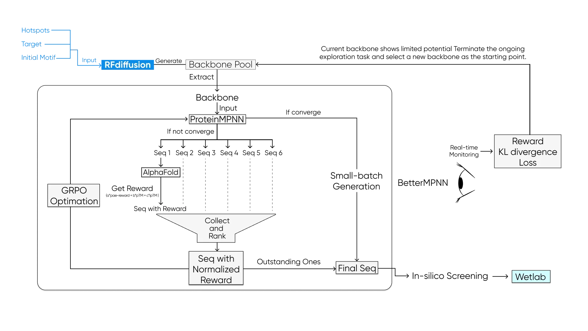
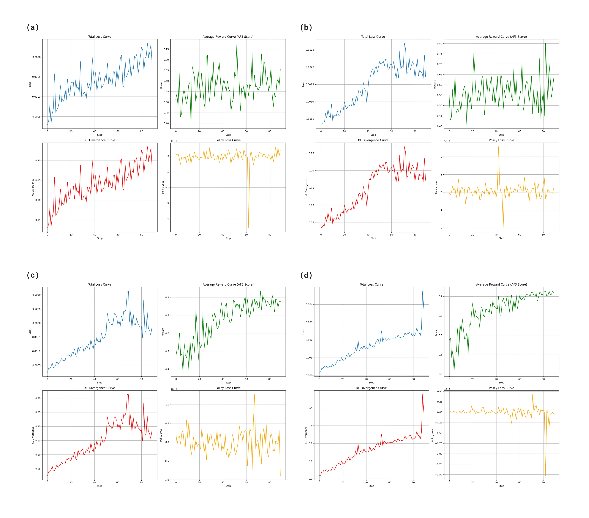

# BetterMPNN

BetterMPNN is a reinforcement learning driven framework for protein sequence deep optimization. We use **Group Relative Policy Optimization (GRPO)** to fine-tune ProteinMPNN in specific tasks, enabling efficient protein sequence design through an exploration-evaluation-optimization loop. With a pluggable structure prediction environment as the reward signal, the framework can complete the design process from backbone to high-performance binding proteins within hours.

## Design

Current protein design tools can generate sequences in a forward pass but have no mechanism to learn from downstream evaluation. BetterMPNN bridges this gap by introducing a reinforcement learning feedback loop: an **Environment** (any structure predictor) scores the generated sequences, and **GRPO** uses those scores to iteratively update ProteinMPNN — enabling the model to learn from evaluation outcomes and progressively converge toward higher-quality designs.



The three components:

- **Agent (ProteinMPNN)** — Generates sequences under fixed-backbone constraints
- **Environment** — Black-box scoring: `sequence → scalar reward`. Pluggable — AF3, Protenix, ESMFold, or any custom predictor
- **GRPO** — Computes group-relative advantages and updates the agent with KL-regularized policy gradient

Each step: sample N sequences → score them → compute advantages relative to the group mean → backpropagate GRPO loss → repeat.

**Reward Function (AlphaFold 3 example)**

The included AF3 environment combines: `Reward = a * (1 - PAE / PAE_MAX) + b * ipTM + c * pTM - d * clash_penalty`

By pre-computing the target's MSA and skipping the binder MSA step, each AF3 evaluation takes ~90 seconds.

## Results

**Binder Design (GZMK Binder for Colloidal Gold Test Strip)**

SPR validation on binder candidates randomly selected from the Final Sequence Pool **without virtual screening**: **83% hit rate (10/12)**, all binders demonstrating micromolar-level affinity. In comparison, the conventional RFdiffusion pipeline achieved a hit rate of only 3.5% (2/57) on the same target.

**Gas-Sensitive Material Design (Odorant Binding Protein)**

Applied to odorant binding protein (OBP) design as gas-sensitive materials, achieving **micromolar-level affinity** for target odorant molecules.

**Training Trajectories**

(a)–(b): suboptimal backbones — noisy rewards, poor convergence. (c)–(d): viable backbones — clear reward improvement over training.



**Included Example**

| | Details |
|:--|:--|
| **Target** | GZMK (238 aa, chain B) |
| **Starting binder** | Helical peptide (58 aa, chain A) |
| **Scaffold** | `examples/scaffold.pdb` |
| **Baseline** | iPTM = 0.64, pTM = 0.86, ranking_score = 0.69 |

## Usage

**Installation**

```bash
git clone https://github.com/Terry-Wang-Lynx/BetterMPNN.git
cd BetterMPNN
conda create -n bettermpnn python=3.11
conda activate bettermpnn
pip install -r requirements.txt
```

Download ProteinMPNN weights:

```bash
cd weights/vanilla/
wget https://files.ipd.uw.edu/pub/training_sets/ProteinMPNN/v_48_020.pt
```

**Run**

```bash
python -m bettermpnn.cli --config configs/example.yaml
```

Override from CLI:

```bash
python -m bettermpnn.cli --config configs/example.yaml \
    --pdb my_scaffold.pdb --chain A --steps 200 --variants 8 -v
```

**Input Files**

1. **Scaffold PDB** — target + binder complex
2. **AF3 template JSON** — sequences with pre-computed MSA (`configs/af3_template.json`)
3. **Config YAML** — training parameters (`configs/example.yaml`)

Only the target needs a rich MSA. The binder uses single-sequence MSA. Obtain MSA from [AlphaFold Server](https://alphafoldserver.com/) or Jackhmmer.

**Key Parameters**

| Parameter | Default | Description |
|:--|:--|:--|
| `pdb` | required | Scaffold PDB |
| `chain` | `"A"` | Chain to redesign |
| `steps` | `200` | Training steps |
| `variants` | `8` | Sequences per step |
| `lr` | `1e-4` | Learning rate |
| `beta` | `0.01` | KL penalty weight |
| `temperature` | `0.3` | Sampling temperature |
| `iterative` | `false` | Update backbone each step |

**Output**

```
output/
├── training_results.json   # Per-step summary
├── variant_log.csv         # Per-variant detail (sequence, score, metrics)
├── training_plot.png       # Training curves
├── mpnn_step_*.pt          # Checkpoints
└── mpnn_final.pt           # Final model
```

**Environment Setup**

AF3 (Singularity):
```yaml
environment:
  af3_sif: "/path/to/alphafold3.sif"
  af3_run_dir: "/path/to/alphafold3"
  af3_model_dir: "/path/to/model"
  af3_db_dir: "/path/to/dataset"
```

AF3 (conda, no container):
```yaml
environment:
  af3_sif: ""
  af3_run_dir: "/path/to/alphafold3"
  af3_model_dir: "/path/to/model"
  af3_env_script: "/path/to/af3_env.sh"
```

Custom environment:
```python
from bettermpnn.environment.base import Environment, EvalResult

class MyPredictor(Environment):
    def evaluate(self, sequence, step=0, variant=0):
        return EvalResult(score=my_model.predict(sequence).confidence)
```

## References

- **ProteinMPNN:** J. Dauparas, et al. *Science* (2022). [Paper](https://www.science.org/doi/10.1126/science.add2187) | [Code](https://github.com/dauparas/ProteinMPNN)
- **AlphaFold 3:** J. Abramson, et al. *Nature* (2024). [Paper](https://www.nature.com/articles/s41586-024-07487-w) | [Code](https://github.com/google-deepmind/alphafold3)
- **GRPO:** DeepSeek-AI. (2025). [Paper](https://github.com/deepseek-ai/DeepSeek-R1/blob/main/DeepSeek_R1.pdf)

## License

MIT License. See [LICENSE](LICENSE).
